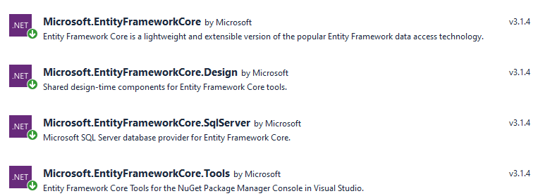
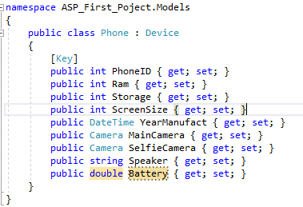
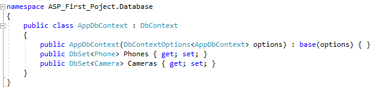
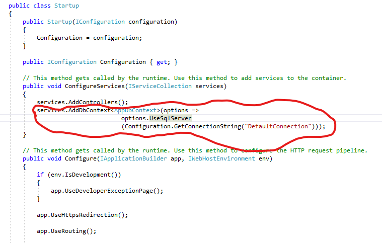
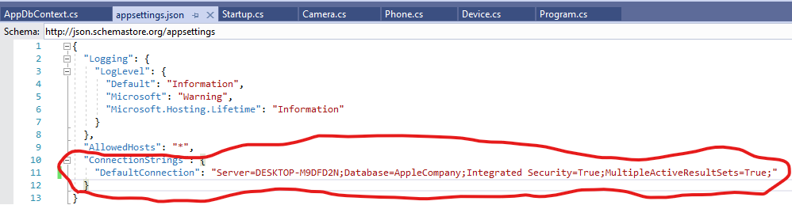
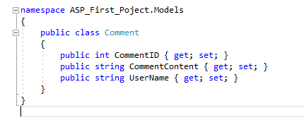

Step to setup Entity to ASP.NET
+ Install a the Nuget Require

+ Create Model and Class

+ SetUp the AppDbContext and then Include the class that need to be mapped to SQL

+ Add Serivce in StartUp.cs

+ Add Connection String to the appsettings.json

/////////////////////////////

+This is how we make one to many relationship

